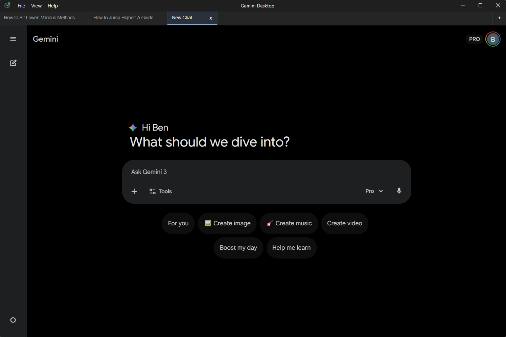

# Gemini Desktop — Native, Private AI Experience

<div align="center">

[](https://github.com/bwendell/gemini-desktop/releases)
[](https://github.com/bwendell/gemini-desktop/commits/main)
[](https://github.com/bwendell/gemini-desktop/releases)
[](https://securityscorecards.dev/viewer/?uri=github.com/bwendell/gemini-desktop)
[](https://github.com/bwendell/gemini-desktop/security/code-scanning)

</div>

> **Gemini, but better.** The privacy-first, native desktop client for Google Gemini. Experience the best free AI desktop app for Windows, macOS, and Linux. Features global hotkeys, Spotlight-style Quick Chat, and zero data collection.

<p align="center">
  <a href="#-installation">Installation</a> •
  <a href="#-quick-chat--spotlight-for-gemini">Quick Chat</a> •
  <a href="#-keyboard-shortcuts">Shortcuts</a> •
  <a href="#-privacy--security-practices">Privacy</a> •
  <a href="#-contributing">Contributing</a>
</p>

---

## ✨ Why This App?

### 🛡️ Safety Guarantee

Start here: **[Read our Transparency Report](docs/TRANSPARENCY.md)** which includes a direct comparison to the "GeminiDesk" malware and explains exactly how we protect your data. We verify every release with checksums and strictly limit network traffic to `google.com`.

Users have been asking for a desktop Gemini client with these features—**we deliver on all of them**:

<div align="center">

| What Users Want                                | Status                       |
| ---------------------------------------------- | ---------------------------- |
| 🖥️ Native desktop app (not just a browser tab) | ✅ **Native & Fast**         |
| ⌨️ Global keyboard shortcuts                   | ✅ **Fully Customizable**    |
| 🚀 Spotlight-style Quick Chat                  | ✅ **Instant Access**        |
| 📌 Always-on-top window                        | ✅ **Easy Access to Gemini** |
| 🕵️ Quick Privacy / Hiding                      | ✅ **Peek and Hide**         |
| 💻 Cross-platform (Windows, macOS, Linux)      | ✅ **All three**             |
| 🔐 Stable login & persistent sessions          | ✅ **OAuth done right**      |
| 🔒 No data collection                          | ✅ **Zero telemetry**        |
| 🖨️ Print to PDF                                | ✅ **Export Chats**          |
| 🔔 Desktop Notifications                       | ✅ **Notify on Reply**       |

</div>

---

### 🚀 Quick Chat - Spotlight for Gemini

**Like macOS Spotlight, but for AI.** Press **`Ctrl+Shift+Space`** (or **`Cmd+Shift+Space`** on Mac) from anywhere—writing code, browsing, reading docs—and a floating command center appears instantly.

<!-- [INSERT QUICK CHAT SCREENSHOT HERE] -->

<div align="center">


</div>

**What makes it powerful:**

- **🌟 Spotlight-Style Access** — Global hotkey summons Gemini over any app, just like `Cmd+Space` on Mac
- **💬 Floating Window** — Centered, always-on-top dialog that doesn't disrupt your workflow
- **⚡ Zero Friction** — Auto-focuses on input, submit your query, then it vanishes—results appear in your main Gemini chat
- **⌨️ Keyboard-First** — Type, submit with Enter, dismiss with Escape. No context switching required
- **🎯 Smart Positioning** — Appears on your active screen, keeps you in the flow

### 🕵️ Peek and Hide

Press **`Ctrl+Alt+H`** (or **`Cmd+Alt+H`**) to toggle the app visibility. First press hides to the system tray — second press restores and focuses the window instantly.

### 📌 Always On Top

Keep Gemini visible while you work. Toggle "Always On Top" mode with **`Ctrl+Shift+T`** (or **`Cmd+Shift+T`**) so you can reference chats without switching windows.

---

## 📥 Installation

### Windows

Download the latest `.exe` installer from [Releases](https://github.com/bwendell/gemini-desktop/releases).

```
Gemini Desktop-x.x.x-x64-installer.exe
```

### macOS

Download the `.dmg` for your architecture from [Releases](https://github.com/bwendell/gemini-desktop/releases):

- **Apple Silicon (M1/M2/M3)**: `Gemini Desktop-x.x.x-arm64.dmg`
- **Intel**: `Gemini Desktop-x.x.x-x64.dmg`

### Linux

Download the `.AppImage` or `.deb` from [Releases](https://github.com/bwendell/gemini-desktop/releases).

```bash
# AppImage
chmod +x "Gemini Desktop-x.x.x-x64.AppImage"
./"Gemini Desktop-x.x.x-x64.AppImage"

# Debian/Ubuntu
sudo dpkg -i "Gemini Desktop-x.x.x-x64.deb"
```

---

## 🔒 Privacy & Security Practices

> 📢 **Detailed Breakdown:** See our full **[Transparency Report](docs/TRANSPARENCY.md)** for network logs, data storage details, and author identity.

**We take your security seriously.**

For full details, please read our [**Privacy Policy**](docs/PRIVACY.md) and [**Security Policy**](docs/SECURITY.md).

<div align="center">

| Category            | Practice            | Details                                                                     |
| ------------------- | ------------------- | --------------------------------------------------------------------------- |
| **🔐 Data**         | No collection       | Zero analytics, telemetry, or tracking                                      |
|                     | Direct connection   | Only connects to `google.com` domains                                       |
|                     | No password storage | Auth handled entirely by Google                                             |
| **🛡️ Security**     | **Automated Scans** | **CodeQL and Dependency Audits run on every commit**                        |
|                     | Context Isolation   | Renderer cannot access Node.js                                              |
|                     | Sandboxed Renderer  | Process isolation enforced                                                  |
|                     | Minimal Permissions | Restricted system access                                                    |
| **💾 Storage**      | Encrypted cookies   | Standard Chromium session storage                                           |
|                     | Local cache only    | Standard browser caching                                                    |
|                     | No cloud sync       | All data stays on your machine                                              |
| **🔍 Transparency** | Open source         | [Full code available](https://github.com/bwendell/gemini-desktop) for audit |
|                     | No paywall bypass   | Respects Google's terms                                                     |

</div>

---

## ⌨️ Keyboard Shortcuts

<div align="center">

| Shortcut            | Action                                |
| ------------------- | ------------------------------------- |
| `Ctrl+Shift+Space`  | Toggle Quick Chat                     |
| `Ctrl+Alt+H`        | **Peek and Hide** (Toggle visibility) |
| `Ctrl+P`            | Print to PDF                          |
| `Ctrl+=` / `Ctrl+-` | Zoom In / Out                         |
| `Ctrl+,`            | Open Settings                         |
| `Escape`            | Close Quick Chat                      |

</div>

> 💡 Hotkeys can be modified in Settings if they conflict with other apps.

---

## 🎯 Features

- 🚀 **Native Experience** — Run Gemini as a standalone desktop app
- 🎨 **Custom Title Bar** — Native-feeling window controls
- 🕵️ **Peek and Hide** — Toggle app visibility: hide to tray or restore with one keystroke
- 📌 **Always On Top** — Pin the window above others
- 🔄 **System Tray** — Minimize to tray, quick access
- 🌙 **Theme Sync** — Follows your system light/dark preference
- ⚡ **Quick Chat** — Spotlight-style prompt from anywhere
- 🔔 **Smart Notifications** — Get notified when long background responses finish
- 🖨️ **Print to PDF** — Save your chats or code snippets as PDF
- 🔍 **Zoom Controls** — Adjust text size for comfortable reading

---

## 🗺️ Roadmap

> **Note:** This roadmap reflects current priorities and may shift based on user feedback and upstream Gemini changes.

### v0.8.0 — Chat Tabs & Release Notes

- **Tabbed conversations** to keep multiple chats open at once. ([#72](https://github.com/bwendell/gemini-desktop/issues/72))
- **Release notes discoverability** via Help menu entry and update toast action buttons.

### v0.9.0 — Peek & Hide

- **Peek and Hide toggle** to quickly show/hide the app without losing context. ([#91](https://github.com/bwendell/gemini-desktop/issues/91))

### Future Work

- **Investigate AI Studio support** and feasibility for a better Gemini Live experience. ([#90](https://github.com/bwendell/gemini-desktop/issues/90))

---

<div align="center">



</div>

---

## 🤝 Contributing

Contributions are welcome! Whether it's bug reports, feature requests, or code contributions.

1. **Fork** the repository
2. **Create** a feature branch (`git checkout -b feature/amazing-feature`)
3. **Commit** your changes (`git commit -m 'Add amazing feature'`)
4. **Push** to the branch (`git push origin feature/amazing-feature`)
5. **Open** a Pull Request

See [CONTRIBUTING.md](docs/CONTRIBUTING.md) for detailed guidelines.

### Reporting Issues

Found a bug? [Open an issue](https://github.com/bwendell/gemini-desktop/issues/new) with:

- Your OS and version
- Steps to reproduce
- Expected vs actual behavior

---

## 🛠️ Development

Built with [Electron](https://www.electronjs.org/) + [React](https://react.dev) + [TypeScript](https://www.typescriptlang.org/) + [Vite](https://vitejs.dev/).

### Prerequisites

- Node.js 18+
- npm 9+

### Quick Start

```bash
# Clone the repository
git clone https://github.com/bwendell/gemini-desktop.git
cd gemini-desktop

# Install dependencies
npm install

# Start development
npm run electron:dev

# Build for production
npm run electron:build

# Run tests
npm run test:all
```

### Project Structure

```
gemini-desktop/
├── src/
│   ├── main/      # Electron main process
│   ├── renderer/  # React frontend
│   └── shared/    # Shared types & constants
├── tests/         # E2E and unit tests
└── build/         # Build assets (icons, etc.)
```

---

## 🧪 Automated Testing

We take stability seriously. Gemini Desktop is backed by a comprehensive automated testing suite ensuring that core features work reliably and regressions are caught early.

### Our Strategy

- **Unit Tests**: Verify individual components and logic in isolation.
- **Integration Tests**: Ensure different parts of the system (Electron main process, renderer, localized APIs) work together smoothly.
- **End-to-End (E2E) Tests**: Simulate real user interactions—clicking, typing, and navigating—to validate full application flows.

### Running Tests

If you're contributing or just curious, you can run the full suite yourself:

```bash
# Run all tests (Unit, Integration, E2E)
npm run test:all

# Run only E2E tests
npm run test:e2e
```

We believe that a robust test suite is key to maintaining a high-quality experience.

### 🧪 Wayland Support & Testing (Linux)

Gemini Desktop supports native global hotkeys on **KDE Wayland** via XDG Desktop Portals.

- **Manual Testing**: See [Wayland Manual Testing Checklist](docs/WAYLAND_MANUAL_TESTING.md).
- **Automated Testing**: Most Wayland tests are skipped in CI due to environment constraints. For local runs, follow the [Wayland Testing Runbook](docs/WAYLAND_TESTING_RUNBOOK.md).
- **Debug Mode**: Run with `DEBUG_DBUS=1` to enable D-Bus signal tracking (see `docs/TEST_ONLY_SIGNAL_TRACKING.md`).

---

## ⭐ Star History

If you find this project useful, please consider giving it a star! ⭐

<!-- [INSERT STAR HISTORY CHART HERE - use https://star-history.com] -->

---

## 💬 Community

- 🐛 [Report a Bug](https://github.com/bwendell/gemini-desktop/issues/new?template=bug_report.md)
- 💡 [Request a Feature](https://github.com/bwendell/gemini-desktop/issues/new?template=feature_request.md)
- 💬 [Discussions](https://github.com/bwendell/gemini-desktop/discussions)

---

## 🙏 Acknowledgments

- [Electron](https://www.electronjs.org/) - Cross-platform desktop framework
- [React](https://react.dev/) - UI library
- [Vite](https://vitejs.dev/) - Build tool
- [Google Gemini](https://gemini.google.com/) - The AI we're wrapping

---

## ⚖️ Legal & Compliance

> [!IMPORTANT]
> **This is an unofficial, open-source project.** It is **NOT** affiliated with, endorsed by, or associated with Google LLC.

### Trademark Notice

- **Gemini** and **Google** are registered trademarks of Google LLC.
- This software is a third-party client and is not a Google product.

### What This App Does

This application is a specialized web browser that loads the official `https://gemini.google.com` website. It does not modify the Gemini service, intercept encrypted data, or bypass any authentication.

### User Responsibility

By using this software, you agree to comply with:

- [Google's Terms of Service](https://policies.google.com/terms)
- [Generative AI Usage Policies](https://policies.google.com/terms/generative-ai)

### Warranty Disclaimer

THE SOFTWARE IS PROVIDED "AS IS", WITHOUT WARRANTY OF ANY KIND, EXPRESS OR IMPLIED. See [LICENSE](LICENSE) for full terms.

---

## 📄 License

[MIT](LICENSE) © [Ben Wendell](https://github.com/bwendell)

---

<p align="center">
  Made with ❤️ by the community
</p>
